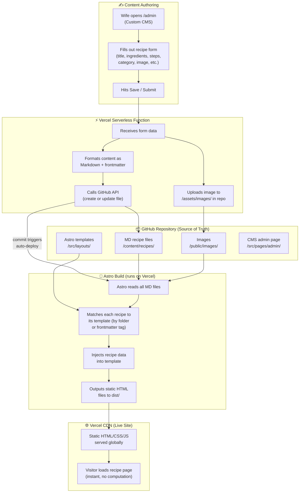

# Recipe Site — Dev Stack Reference

## Stack Summary

> **Note:** Project runs in `output: 'server'` mode (Astro v6). All public-facing
> pages require `export const prerender = true` in their frontmatter.

| Layer | Tool | Role |
|---|---|---|
| Hosting & Functions | Vercel | Serves the site, runs serverless functions |
| Build Tool | Astro | Converts MD + templates → static HTML |
| Source of Truth | GitHub | Stores all source files, triggers deploys |
| Content Management | Custom CMS (`/admin`) | Wife's interface for adding/editing recipes |

---

## How It All Fits Together



---

## Key Concepts to Remember

### GitHub is the single source of truth
Everything important lives in the repo — recipe MD files, images, templates, and the admin CMS code. Vercel is disposable; if you ever needed to switch hosts, you'd point a new host at the same repo and get the same site.

### Vercel builds once per commit, not per page load
When a new commit hits GitHub, Vercel spins up, runs `astro build`, and stores the output on their CDN. Visitors receive pre-built HTML files — no processing at request time. This is what makes the site fast and keeps it well within Vercel's free tier limits.

### Astro separates content from presentation
- **MD files** = the *what* (recipe data)
- **Astro templates** = the *how* (layout and design)
- They are never mixed together. Updating a template rebuilds every recipe page automatically on next deploy.

### Multiple templates are supported
Templates can be assigned by folder location or by a `template:` tag in the MD file's frontmatter. Useful for different recipe types (standard, drinks, quick/simple).

### Editing existing recipes
The custom CMS supports both creating and editing recipes. The admin page fetches existing MD files from GitHub, pre-populates the form, and on save calls the GitHub API to update the file in place (same flow as create, different API call).

---

## Frontmatter Reference (MD file header)

Every recipe MD file starts with a YAML frontmatter block that Astro reads as structured data:

```yaml
---
title: "Grandma's Lasagna"
category: "Italian"          # controls folder/routing
template: "recipe-full"      # optional: explicit template override
prepTime: 30                 # minutes
cookTime: 90                 # minutes
servings: 8
difficulty: "medium"         # easy | medium | hard
tags: ["pasta", "comfort food", "make-ahead"]
image: "/images/lasagna.jpg"
---

Recipe body / notes in plain Markdown here...
```

---

## Repo Structure (planned)


```
/
├── src/
	│   .
	├── components
	│   ├── Header.astro
	│   └── Welcome.astro
	├── content.config.ts
	├── layouts
	│   └── Layout.astro
	│   └── AdminLayout.astro
	|-- Pages
	│	├── admin
	│	│   ├── index.astro
	│	│   ├── login.astro
	│	│   ├── logout.ts
	│	│   └── new.astro
	│	├── api
	└	│   └── admin-login.ts
	│	├── index.astro
	│	└── recipes
	│		├── [slug].astro
	│		└── print
	│			└── [slug].astro
	├── scripts
	│   └── scaleIngredients.ts
	├── styles
	│   └── global.css
	└── utils
		└── seo.ts
├── public/
	│   .
	├── fonts
	│   ├── DMSans-Italic-VariableFont.woff2
	│   ├── DMSans-VariableFont.woff2
	│   ├── PTSerif-Bold.woff2
	│   ├── PTSerif-BoldItalic.woff2
	│   ├── PTSerif-Italic.woff2
	│   └── PTSerif-Regular.woff2
	└── images
		├── HP-Banner-Dark.png
		├── HP-Banner.png
		├── logo
		│   ├── android-chrome-192x192.png
		│   ├── android-chrome-512x512.png
		│   ├── apple-touch-icon.png
		│   ├── BK_Logo Original Style Inspiration.png
		│   ├── BK-Favicon-thin.png
		│   ├── BK-favicon.png
		│   ├── BK-Logo-Color.png
		│   ├── BK-Logo-Header.png
		│   ├── BK-Logo-Text.png
		│   ├── favicon-16x16.png
		│   ├── favicon-32x32.png
		│   ├── favicon.ico
		│   └── site.webmanifest
		├── og
		│   ├── og-default.jpg
		│   └── og-default.png
		└── recipes
			└── Brownies.jpg
├── content/
	└── recipes
		├── blank.gitkeep
		└── desserts
			└── best-homemade-brownies.md
├── api/
│   └── save-recipe.js             # Vercel serverless function (Phase 2 — pending)
└── astro.config.mjs
```

---

## Deployment Flow (simplified)

```
Wife submits form → Vercel function → GitHub commit → Vercel auto-deploy → Site updated
```

Average time from "save recipe" to "live on site": **~30–60 seconds** (Astro build time).
```

---

### Known Dev Constraints

**Pagefind (search) does not work in `astro dev`.**
Pagefind indexes the *built* output, not the dev server. Search will silently
do nothing locally. To test search, run:

    astro build && astro preview

The header dropdown and `/search` page will both work correctly in preview and
production. This is an expected limitation of static search indexing.

---

## Build Log

### Step 1 — Vercel ↔ GitHub Connection
✅ Complete

### Step 2 — Astro Project Scaffolding
✅ Complete

### Step 3 — Design Tokens / Global CSS
✅ Complete
- Global stylesheet at `src/styles/global.css`
- Imported in base Astro layout (pending — Step 4)
- Fonts self-hosted in `/public/fonts/`
- CSS variables use semantic aliases; always reference those in components

### Step 4 — Core Astro Layouts
✅ Complete
✅ Dynamic route at `src/pages/recipes/[slug].astro`
✅ Content collection defined in `src/content.config.ts`
✅ Recipe markdown files stored in `/content/recipes/`
✅ Global stylesheet imported via frontmatter in `Layout.astro`
✅ Header component at `src/components/Header.astro` — single-row sticky nav, dropdown menus, desktop search overlay, mobile hamburger menu with integrated search bar- Home page at `src/pages/index.astro` — category tiles, latest recipes, about blurb
✅ Brownie recipe live at `/recipes/best-homemade-brownies`
✅ All recipe data sourced from frontmatter — no hardcoded content in templates
✅ MD body reserved for optional freeform notes (gated by `hasNotes` frontmatter flag)

### Step 5 — SEO & Structured Data
✅ Complete
- Utility module at `src/utils/seo.ts`
- `Layout.astro` updated: canonical URL, robots meta, OG tags, Twitter Card, JSON-LD
- `[slug].astro`: Recipe schema with HowToStep instructions
- `index.astro`: WebPage schema
- Print pages need explicit `noindex, nofollow` — no Layout.astro inheritance

### Step 6 — CMS Phase 0
✅ Complete
- Astro config updated to `output: 'server'`; all public pages marked `export const prerender = true`
- Vercel adapter installed (`@astrojs/vercel` v10)
- Middleware auth implemented — see CMS.md for full details
- All required environment variables set in `.env` (local) and Vercel dashboard
- Next: Phase 1 — Admin UI scaffold (see CMS.md)

### Step 7 — CMS Phase 1
✅ Complete
- Admin layout, dashboard, and recipe form built (see CMS.md for full details)
- Next: Phase 2 — Create Recipe API (`/api/save-recipe.js`)


